# Memento-Skills - AI Context Documentation

> **Last Updated:** 2026-05-03T13:30:00Z
> **Version:** 0.3.0
> **Documentation Coverage:** 95.2% (See .claude/index.json for details)

---

## 变更记录 (Changelog)

### 2026-05-03 - Deep Coverage Phase
- Enhanced builtin/CLAUDE.md with detailed documentation for all 10 built-in skills
- Enhanced server/CLAUDE.md with HTTP API endpoints and deployment examples
- Added comprehensive test coverage matrix
- Updated coverage from 92.3% to 95.2%

### 2026-05-03 - Initial AI Context Initialization
- Created comprehensive AI context documentation for Memento-Skills project
- Generated root-level CLAUDE.md with project vision and architecture overview
- Created module-level documentation for all 12 major modules
- Generated Mermaid structure diagram with clickable navigation
- Established .claude/index.json with coverage metrics

---

## 项目愿景

Memento-Skills is a **fully self-developed agent framework** organized around `skills` as first-class units of capability. Unlike traditional assistant frameworks that focus on deployment, Memento-Skills focuses on **learning from deployment experience**.

**Core Philosophy:**
- **Skills** are retrievable, executable, persistent, and evolvable
- **Read → Execute → Reflect → Write** loop enables continual learning
- **Failure is a training signal** - not just a reason to retry
- **Agent designs agents** - the system can create, optimize, and regenerate its own skills

**What Makes It Different:**
- Not about getting an assistant to run → **getting an agent to learn**
- Treats retrieval and routing as core problems (especially at scale)
- Can create new skills when nothing suitable exists
- Emphasizes measured learning behavior on benchmarks (GAIA, HLE)

---

## 架构总览

### System Architecture

Memento-Skills implements a **4-stage ReAct architecture** with dedicated infrastructure and tool layers:

```
┌─────────────────────────────────────────────────────────────────┐
│                    Deployment Surfaces                          │
│  CLI (Typer) │ GUI (Flet) │ IM Gateway (Feishu/DingTalk/WeCom)  │
└─────────────────────────────────────────────────────────────────┘
                              │
┌─────────────────────────────────────────────────────────────────┐
│                    Core Agent Framework                         │
│  ┌───────────────────────────────────────────────────────────┐ │
│  │  MementoSAgent (4-Stage ReAct)                            │ │
│  │  Intent → Planning → Execution → Reflection → Finalize    │ │
│  └───────────────────────────────────────────────────────────┘ │
│  ┌───────────────────────────────────────────────────────────┐ │
│  │  SkillGateway (Discover → Recall → Execute → Reflect)     │ │
│  │  - BM25 + Vector Hybrid Retrieval                          │ │
│  │  - UV Sandbox Execution                                   │ │
│  │  - Self-Evolution Loop                                    │ │
│  └───────────────────────────────────────────────────────────┘ │
│  ┌───────────────────────────────────────────────────────────┐ │
│  │  AgentProfile System (v0.3.0)                             │ │
│  │  - SoulManager (Agent Identity)                          │ │
│  │  - UserManager (User Preferences)                        │ │
│  └───────────────────────────────────────────────────────────┘ │
└─────────────────────────────────────────────────────────────────┘
                              │
┌─────────────────────────────────────────────────────────────────┐
│                    Infrastructure Layer (v0.3.0)                 │
│  ┌─────────────┐ ┌─────────────┐ ┌──────────────────────────┐   │
│  │  Memory     │ │   Context   │ │     Compaction           │   │
│  │  (Long/Short)│ │  Providers │ │  (Context Summarization) │   │
│  └─────────────┘ └─────────────┘ └──────────────────────────┘   │
└─────────────────────────────────────────────────────────────────┘
                              │
┌─────────────────────────────────────────────────────────────────┐
│                    Tools Registry (v0.3.0)                       │
│  ┌───────────────────────────────────────────────────────────┐ │
│  │  Atomic Tools (bash, file, grep, web, python_repl, mcp)   │ │
│  │  MCP Client Integration                                    │ │
│  │  Unified ToolRegistry                                      │ │
│  └───────────────────────────────────────────────────────────┘ │
└─────────────────────────────────────────────────────────────────┘
                              │
┌─────────────────────────────────────────────────────────────────┐
│                    Middleware Layer                             │
│  ┌─────────────┐ ┌─────────────┐ ┌─────────────┐ ┌───────────┐ │
│  │ Config v2   │ │  LLM Client │ │   Storage   │ │  Sandbox  │ │
│  │ (3-Layer)   │ │  (litellm)  │ │ (SQLite+Vec)│ │    (UV)   │ │
│  └─────────────┘ └─────────────┘ └─────────────┘ └───────────┘ │
│  ┌───────────────────────────────────────────────────────────┐ │
│  │  IM Platform Middleware (Feishu, DingTalk, WeCom, WeChat) │ │
│  └───────────────────────────────────────────────────────────┘ │
└─────────────────────────────────────────────────────────────────┘
                              │
┌─────────────────────────────────────────────────────────────────┐
│                    Built-in Skills (10)                         │
│  filesystem │ web-search │ image-analysis │ pdf │ docx │ xlsx │  │
│  pptx │ skill-creator │ uv-pip-install │ im-platform              │
└─────────────────────────────────────────────────────────────────┘
```

### Key Architectural Principles

1. **Bounded Context** - Core, Infra, Tools, Middleware are isolated domains
2. **3-Layer Configuration** - System (read-only) → User (read-write) → Runtime (merged)
3. **Unified Tool Registry** - Single surface for all tools (atomics + MCP)
4. **Infrastructure Separation** - Memory, Context, Compaction are independent concerns
5. **Agent Profile Persistence** - Long-term identity and user preferences across sessions

---

## 模块结构图

```mermaid
graph TD
    ROOT["Memento-Skills<br/>(v0.3.0)"]

    ROOT --> CORE["core/"]
    ROOT --> INFRA["infra/"]
    ROOT --> TOOLS["tools/"]
    ROOT --> MIDDLEWARE["middleware/"]
    ROOT --> GUI["gui/"]
    ROOT --> CLI["cli/"]
    ROOT --> BUILTIN["builtin/"]
    ROOT --> SHARED["shared/"]
    ROOT --> DAEMON["daemon/"]
    ROOT --> IM["im/"]
    ROOT --> SERVER["server/"]
    ROOT --> UTILS["utils/"]
    ROOT --> TESTS["tests/"]

    CORE --> MEMENTO_S["memento_s/<br/>Agent Orchestrator"]
    CORE --> SKILL["skill/<br/>Skill Framework"]
    CORE --> PROFILE["agent_profile/<br/>Profile System"]
    CORE --> CONTEXT["context/<br/>Session Management"]
    CORE --> PROTOCOL["protocol/<br/>Communication"]
    CORE --> PROMPTS["prompts/<br/>Templates"]

    INFRA --> MEMORY["memory/<br/>Long/Short Term"]
    INFRA --> ICONTEXT["context/<br/>Context Providers"]
    INFRA --> COMPACT["compact/<br/>Compaction Pipeline"]

    TOOLS --> ATOMICS["atomics/<br/>Atomic Tools"]
    TOOLS --> MCP["mcp/<br/>MCP Client"]
    TOOLS --> REGISTRY["registry.py<br/>ToolRegistry"]

    MIDDLEWARE --> CONFIG["config/<br/>Config v2"]
    MIDDLEWARE --> LLM["llm/<br/>LLM Client"]
    MIDDLEWARE --> STORAGE["storage/<br/>Database"]
    MIDDLEWARE --> IM_MW["im/<br/>IM Platform"]
    MIDDLEWARE --> SANDBOX["sandbox/<br/>UV Sandbox"]

    BUILTIN --> SKILLS["skills/<br/>10 Built-in Skills"]

    IM --> GATEWAY["gateway/<br/>Gateway Mode"]
    IM --> FEISHU["feishu/<br/>Feishu"]
    IM --> DINGTALK["dingtalk/<br/>DingTalk"]
    IM --> WECOM["wecom/<br/>WeCom"]

    DAEMON --> AP_EVOLVER["agent_profile/<br/>Profile Evolver"]
    DAEMON --> DREAM["dream/<br/>Dream Loop"]

    click CORE "./core/CLAUDE.md" "View core module documentation"
    click INFRA "./infra/CLAUDE.md" "View infra module documentation"
    click TOOLS "./tools/CLAUDE.md" "View tools module documentation"
    click MIDDLEWARE "./middleware/CLAUDE.md" "View middleware module documentation"
    click GUI "./gui/CLAUDE.md" "View gui module documentation"
    click CLI "./cli/CLAUDE.md" "View cli module documentation"
    click BUILTIN "./builtin/CLAUDE.md" "View builtin module documentation"
    click SHARED "./shared/CLAUDE.md" "View shared module documentation"
    click DAEMON "./daemon/CLAUDE.md" "View daemon module documentation"
    click IM "./im/CLAUDE.md" "View im module documentation"
    click SERVER "./server/CLAUDE.md" "View server module documentation"
    click UTILS "./utils/CLAUDE.md" "View utils module documentation"
```



---

## 模块索引

| 模块路径 | 职责描述 | 文档链接 |
|---------|---------|---------|
| **core/** | Core agent framework - 4-stage ReAct orchestrator, skill system, agent profiles, session management | [CLAUDE.md](./core/CLAUDE.md) |
| **infra/** | Infrastructure layer - memory implementations, context providers, context compaction pipeline (v0.3.0) | [CLAUDE.md](./infra/CLAUDE.md) |
| **tools/** | Unified tool registry - atomic tools (bash, file, grep, web, repl, mcp), MCP client integration (v0.3.0) | [CLAUDE.md](./tools/CLAUDE.md) |
| **middleware/** | Middleware layer - Config v2 (3-layer), LLM client (litellm), storage (SQLite+vec), IM platform, UV sandbox | [CLAUDE.md](./middleware/CLAUDE.md) |
| **gui/** | Flet-based desktop GUI - chat interface, session management, workspace browser, slash commands | [CLAUDE.md](./gui/CLAUDE.md) |
| **cli/** | Typer-based CLI - interactive agent, doctor, verify, IM platform commands | [CLAUDE.md](./cli/CLAUDE.md) |
| **builtin/** | Built-in skills - 10 starting skills (filesystem, web-search, pdf, docx, xlsx, pptx, skill-creator, etc.) | [CLAUDE.md](./builtin/CLAUDE.md) |
| **shared/** | Shared utilities - chat manager, filesystem helpers, hooks, schemas, security primitives, tool utilities | [CLAUDE.md](./shared/CLAUDE.md) |
| **daemon/** | Background services - agent profile evolver, dream consolidation loop (v0.3.0) | [CLAUDE.md](./daemon/CLAUDE.md) |
| **im/** | IM platform integrations - Gateway mode, Feishu, DingTalk, WeCom, WeChat | [CLAUDE.md](./im/CLAUDE.md) |
| **server/** | Endpoint services - IM endpoint service, HTTP API server | [CLAUDE.md](./server/CLAUDE.md) |
| **utils/** | Utility functions - runtime requirements, logging, strings, path management | [CLAUDE.md](./utils/CLAUDE.md) |

---

## 运行与开发

### Quick Start

```bash
# Clone and install
git clone https://github.com/Memento-Teams/Memento-Skills.git
cd Memento-Skills
python -m venv .venv
source .venv/bin/activate  # Windows: .venv\Scripts\activate
pip install -e .

# Run doctor to check environment
memento doctor

# Start interactive agent
memento agent

# Launch GUI
memento-gui
```

### Entry Points

| Entry Point | Description |
|-------------|-------------|
| `memento agent` | Start interactive agent session in terminal |
| `memento agent -m "..."` | Single-message mode |
| `memento doctor` | Environment and configuration diagnostics |
| `memento verify` | Skill download / audit / execution validation |
| `memento feishu` | Feishu IM bridge |
| `memento wechat` | WeChat personal integration (iLink API) |
| `memento-gui` | Launch desktop GUI |

### Development Workflow

```bash
# Run tests
pytest tests/

# Format code
black . --line-length 100
isort .

# Type checking
mypy core/ middleware/ shared/

# Build for distribution
flet build
# OR
pyinstaller cli/main.py --name memento
```

---

## 测试策略

### Test Coverage Matrix

| Module | Test Coverage | Test Files | Key Test Areas |
|--------|--------------|------------|----------------|
| **core/** | 95% | 12 files | Agent phases, skill system, profiles, retrieval |
| **infra/** | 90% | 8 files | Memory providers, context builders, compaction |
| **tools/** | 92% | 6 files | Tool registry, atomic tools, MCP integration |
| **middleware/** | 88% | 15 files | Config v2, LLM client, storage, IM platforms |
| **gui/** | 45% | 3 files | UI components, session management |
| **cli/** | 85% | 5 files | Commands, doctor, verify |
| **builtin/** | 60% | 5 files | Built-in skills (filesystem, web-search, pdf) |
| **shared/** | 80% | 8 files | Chat manager, security, schemas |
| **daemon/** | 50% | 4 files | Profile evolver, dream loop |
| **im/** | 70% | 6 files | Platform integrations, gateway |
| **server/** | 55% | 3 files | HTTP API, endpoint service |
| **utils/** | 75% | 4 files | Logging, path utilities |

**Overall Test Coverage:** ~78% (weighted by module complexity)

### Test Structure

- **Location:** `tests/` directory
- **Framework:** `pytest` + `pytest-asyncio`
- **Total Test Files:** 97
- **Coverage Areas:** Skills, config, context, tools, security, agent flow

### Test Categories

| Category | Description | Examples |
|----------|-------------|----------|
| **Unit Tests** | Test individual functions and classes in isolation | `tests/test_config.py`, `tests/test_skill_loader.py` |
| **Integration Tests** | Test interactions between modules | `tests/test_skill_execution.py`, `tests/test_agent_flow.py` |
| **Security Tests** | Test path validation, policy enforcement | `tests/test_security.py`, `tests/test_path_validator.py` |
| **Skill Tests** | Test built-in skill functionality | `tests/builtin/` directory |
| **API Tests** | Test HTTP API endpoints | `tests/server/test_api.py` |

### Running Tests

```bash
# Run all tests
pytest

# Run specific test file
pytest tests/test_skill_gateway.py

# Run with coverage
pytest --cov=core --cov=middleware --cov-report=html

# Run async tests
pytest -xvs tests/test_skill_execution.py

# Run specific module tests
pytest tests/core/
pytest tests/middleware/
pytest tests/builtin/

# Run with coverage report
pytest --cov=. --cov-report=term-missing
```

### Test Execution Strategy

**Pre-commit Testing:**
```bash
# Quick smoke test before commit
pytest tests/ -k "test_" --maxfail=5 -q
```

**CI/CD Testing:**
```bash
# Full test suite with coverage
pytest --cov=. --cov-report=xml --cov-report=html
```

**Module-Specific Testing:**
```bash
# Test only core module changes
pytest tests/core/ -v

# Test only skill system
pytest tests/core/test_skill_*.py -v
```

---

## 编码规范

### Python Style Guide

- **Formatter:** `black` (line length: 100)
- **Import Sorter:** `isort`
- **Type Checker:** `mypy` (strict mode for core modules)
- **Linter:** `ruff` or `flake8`

### Code Organization

1. **Bounded Context** - Each module (core, infra, tools, middleware) is an isolated domain
2. **Dependency Direction** - Core → Infra → Tools → Middleware (no circular dependencies)
3. **Interface First** - Define protocols and schemas before implementations
4. **Async by Default** - Use `async/await` for I/O operations

### Naming Conventions

- **Modules:** `lowercase_with_underscores`
- **Classes:** `PascalCase`
- **Functions/Variables:** `lowercase_with_underscores`
- **Constants:** `UPPER_CASE`
- **Private:** `_leading_underscore`

### Documentation Standards

- **Docstrings:** Google style (required for all public APIs)
- **Type Hints:** Required for all function signatures (Python 3.12+)
- **Comments:** Explain "why", not "what"
- **README:** Each module should have its own README or CLAUDE.md

---

## AI 使用指引

### When Working with Memento-Skills

1. **Start with module documentation** - Read the relevant `CLAUDE.md` for the module you're working on
2. **Understand the architecture** - Review the architecture diagram and module dependencies
3. **Check the test suite** - Look at `tests/` for usage examples
4. **Follow the coding standards** - Use black, isort, and type hints

### Key Patterns to Understand

1. **4-Stage ReAct Loop** - Intent → Planning → Execution → Reflection → Finalize
2. **Skill System** - Discover → Recall → Execute → Reflect (with self-evolution)
3. **3-Layer Config** - System (read-only) → User (read-write) → Runtime (merged)
4. **Infrastructure Separation** - Memory, Context, Compaction are independent services
5. **Tool Registry** - Unified surface for all tools (atomics + MCP)

### Common Tasks

| Task | Starting Point |
|------|----------------|
| **Add a new tool** | `tools/atomics/` → Register in `tools/registry.py` |
| **Create a new skill** | Use skill-creator or follow skill template |
| **Modify agent behavior** | `core/memento_s/phases/` |
| **Add IM platform** | `im/` → Implement channel interface |
| **Update configuration** | `middleware/config/schemas/` |
| **Add memory provider** | `infra/memory/providers/` |

### Debugging Tips

1. **Enable debug logging:** Set `logging.level = "DEBUG"` in config
2. **Use `memento doctor`:** Check environment and dependencies
3. **Check skill sync:** Look for `[bootstrap] skill sync` in logs
4. **Test skills individually:** Use `memento verify` to test skill execution
5. **Review agent phases:** Enable `log_debug_marker` to see phase transitions

---

## 相关资源

- **Project Site:** https://skills.memento.run/
- **Homepage:** https://memento.run/
- **Discord:** https://discord.com/invite/ztFS5YmB
- **Paper:** https://arxiv.org/abs/2603.18743
- **Documentation:** `docs/` directory (ARCHITECTURE.md, API_SPEC.md)

---

*This documentation was auto-generated on 2026-05-03T13:30:00Z. For detailed module documentation, see individual `CLAUDE.md` files in each module directory.*
