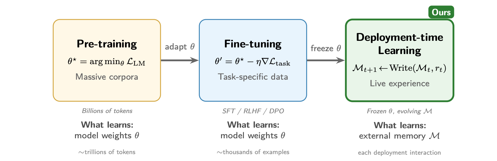

<h1 align="center">Memento-Skills: Let Agents Design Agents</h1>

<h3 align="center"><b>Deploy an agent. Let it learn, rewrite, and evolve its own skills.</b></h3>

<p align="center">
  
  
  
  
  
  
  
  
  
</p>

<p align="center">
  <a href="https://memento.run/"></a>
  <a href="https://skills.memento.run/"></a>
  <a href="https://discord.com/invite/ztFS5YmB"></a>
</p>

<p align="center">
  <a href="#-whats-new-in-v030">What's New</a> ·
  <a href="#-learning-results">Learning Results</a> ·
  <a href="#-one-click-gui-install">Install</a> ·
  <a href="#-quick-start-developer">Quick Start</a> ·
  <a href="#what-is-memento-skills">What Is This</a> ·
  <a href="#what-makes-it-different">Why It Matters</a> ·
  <a href="#-memento-ecosystem">Ecosystem</a> ·
  <a href="#citation">Citation</a>
</p>

<p align="center">
  <a href="#what-is-memento-skills"><b>English</b></a> ·
  <a href="#chinese-summary"><b>中文摘要</b></a>
</p>

<table>
<tr><td>
<p align="center">
  
</p>
<p align="center"><sub>The three paradigms of LLM adaptation. <b>Pre-training</b> and <b>fine-tuning</b> update the model parameters <i>θ</i> and require large data and compute budgets. <b>Deployment-time learning</b> (this work) keeps <i>θ</i> frozen and instead accumulates experience in an external skill memory <i>M</i>, enabling continual adaptation from live interactions at zero retraining cost.</sub></p>
</td></tr>
</table>

<table>
<tr><td>
<p align="center">
  
</p>
<p align="center"><sub>The architecture of the Self-Evolving Agent based on Read-Write Reflective Learning. When a user submits a task, the agent uses a skill router to either retrieve an executable skill from its skill library or generate a new one from scratch, which it then executes to solve the problem. Following execution, the system reflects on the outcome to write back to the library, either by increasing the skill's utility score if the action was successful, or by optimising its underlying skill folders if it failed. This continuous read-write loop enables the agent to progressively expand and refine its capabilities through continual learning, entirely without updating the underlying LLM parameters.</sub></p>
</td></tr>
</table>

---

## What's New in v0.3.0

> **v0.3.0** focuses on cleaner separation of concerns. The runtime is now organised into a dedicated infrastructure layer, a unified tool registry, and a long-lived agent profile system, so that core agent logic, infrastructure, and tools can evolve independently.

### Infrastructure Layer (`infra/`)

A new top-level `infra/` package isolates infrastructure concerns from `core/` so that agent logic and platform code can evolve independently.

| Module | Description |
| --- | --- |
| `infra/memory/` | Long-term and session memory implementations, plus context-block builders. |
| `infra/context/` | Pluggable context providers and shared utilities used by the runtime. |
| `infra/compact/` | Context compaction pipeline (strategies, storage, models, utilities) for long-conversation summarisation. |
| `infra/service.py` | `InfraService` entry that wires the above into the agent runtime. |
| `infra/shared/` | Shared compact / extract helpers reused across providers. |

### Unified Tool Registry (`tools/`)

Tooling has been promoted to a top-level `tools/` package with a single `ToolRegistry`. The previous `builtin/tools/` layer has been retired in favour of this unified surface.

| Module | Description |
| --- | --- |
| `tools/atomics/` | Atomic tools (bash, file ops, grep, glob, list, web, python_repl, js_repl, MCP wrappers). |
| `tools/mcp/` | MCP client integration for loading external MCP servers as tools. |
| `tools/registry.py` | Single registration / discovery surface (`get_registry`) consumed by the agent and skill executor. |

### Agent Profile System

`core/agent_profile/` introduces persistent profiles that capture an agent's long-term identity, while a matching `daemon/agent_profile/` package evolves those profiles in the background.

| Module | Description |
| --- | --- |
| `core/agent_profile/manager.py` | Read / write API for soul and user profiles. |
| `core/agent_profile/soul_manager.py` | Maintains the agent's long-term identity, traits, and policies. |
| `core/agent_profile/user_manager.py` | Tracks per-user preferences and history. |
| `daemon/agent_profile/orchestrator.py` | Background orchestrator that triggers soul / user evolution. |
| `daemon/agent_profile/soul_evolver.py` / `user_evolver.py` | Periodically refines profiles from recent conversations and outcomes. |

### Dream Daemon

A new `daemon/dream/` package runs background consolidation between sessions, similar to how reflection updates the skill library.

| Module | Description |
| --- | --- |
| `daemon/dream/consolidator.py` | Consolidates recent experiences into long-term memory and skill candidates. |
| `daemon/dream/loop.py` | Long-running loop that schedules consolidation passes. |

### Shared Layer Expansion (`shared/`)

The `shared/` package has grown beyond chat utilities into a broader foundation for cross-cutting helpers.

| Module | Description |
| --- | --- |
| `shared/fs/` | Filesystem helpers shared by core, infra, and tools. |
| `shared/hooks/` | Lifecycle hooks for runtime extension points. |
| `shared/schema/` | Reusable schema definitions. |
| `shared/security/` | Path / argument security primitives. |
| `shared/tools/` | Common tool utilities and dispatcher helpers. |

### Runtime & Developer Experience

| Addition | Description |
| --- | --- |
| `utils/runtime_requirements/` | Runtime dependency checker and auto-installer that resolves missing packages on first use. |
| `utils/runtime_mode.py` | Runtime mode detection (CLI vs GUI vs daemon). |
| `utils/log_config.py` | Centralised logging configuration. |
| `utils/strings.py` | Shared string helpers used across the codebase. |
| `core/skill/downloader/` | Dedicated downloader pipeline split out from the skill market. |
| `docs/ARCHITECTURE.md`, `docs/API_SPEC.md` | Up-to-date architecture and API references. |
| `docs/dependency_auto_install.md`, `docs/README_DEPENDENCY.md` | Runtime dependency model and auto-install behaviour. |
| `docs/database_optimization.md`, `docs/uni_response_design.md` | New design notes for storage and unified response handling. |

### Refactors and Removals

The new layout supersedes several v0.2.0 modules. The v0.2.0 `tool_bridge/` layer (`runner`, `bridge`, `context`, `args_processor`, `result_processor`) is replaced by the unified `tools/` registry. `builtin/tools/` (bash, file_ops, grep, python_repl, web) has been moved to `tools/atomics/`. The monolithic `core/skill/execution/executor.py` and `core/context/manager.py`, together with `core/context/{block,scratchpad,runtime_state,memory}.py`, have been split into `tools/`, `infra/context/`, and `infra/memory/`. IM startup no longer goes through `middleware/im/gateway_starter.py` and `middleware/im/gateway/agent_worker.py`; both are removed and replaced by a single `EndpointService` (`server/endpoint/im/`) that manages all IM channels and the agent worker. `bootstrap.py` and `middleware/llm/llm_client.py` have been reworked to align with this new wiring.

### Compatibility Notes

- Modules previously imported from `builtin.tools.*` are now under `tools.*` (for example, `tools.atomics`, `tools.mcp`, `tools.registry`).
- Modules previously under `core/shared/*` (compact, memory, context wiring) now live under `infra/*`. Update any direct imports accordingly.
- `core/manager/` has been removed; conversation and session management now lives in `shared/chat/`.
- IM channels are now started via `EndpointService.start_channel(...)` (`server/endpoint/im/`); direct use of `gateway_starter` / `agent_worker` no longer applies.

---

## What's New in v0.2.0

> **v0.2.0** is a major architectural upgrade. The core agent, skill system, configuration layer, and deployment surfaces have all been redesigned or significantly extended compared to v0.1.0.

### Core Architecture

| Change | Description |
| --- | --- |
| **Bounded Context redesign** | The agent and skill modules have been restructured using a Bounded Context architecture, improving modularity and long-term maintainability. |
| **Execution phase refactoring** | The monolithic execution phase has been split into dedicated sub-modules (`runner`, `tool_handler`, `step_boundary`, `helpers`), enabling finer-grained control over multi-step reasoning. |
| **New Finalize phase** | A dedicated `finalize` phase has been added to the 4-stage pipeline for structured result summarisation. |
| **Protocol layer** | A new `core/protocol/` module defines communication protocols between system components. |
| **Tool Bridge system** | A new `tool_bridge/` layer (`runner`, `bridge`, `context`, `args_processor`, `result_processor`) provides cleaner tool invocation and result handling. |
| **Execution policies** | New policy modules (`tool_gate`, `path_validator`, `pre_execute`, `recovery`) add fine-grained safety and execution control. |
| **Error recovery and loop detection** | New `error_recovery.py` and `loop_detector.py` modules handle agent self-repair and infinite loop prevention during skill execution. |

### Configuration System v2

| Change | Description |
| --- | --- |
| **Three-layer isolation** | System Config (read-only defaults) / User Config (persistent customisation) / Runtime Config (merged at startup). |
| **Automatic migration** | When the config template updates, the system auto-merges new fields while preserving user-modified values via `x-managed-by: user` markers. |
| **Schema validation** | Pydantic-based config models with JSON Schema for IDE auto-completion and validation. |

### Skill Ecosystem

| Change | Description |
| --- | --- |
| **Skill Market** | A built-in marketplace for searching, downloading, and auto-installing skills from the cloud catalogue. |
| **Skill Builder** | New `core/skill/builder/` module for programmatic skill creation and generation. |
| **Skill Loader** | New `core/skill/loader/` replaces the old importer system with a cleaner discovery and loading pipeline. |
| **Enhanced retrieval** | Retrieval has been refactored into `local_db_recall`, `local_file_recall`, and `remote_recall`, with BM25 + semantic vector hybrid search for improved routing accuracy. |
| **Pluggable storage** | Skill store now supports `db_storage`, `file_storage`, and `vector_storage` backends. |
| **Content analyser** | New `content_analyzer.py` for inspecting and validating skill outputs. |

### IM Platform Integration (New)

| Platform | Mode | Notes |
| --- | --- | --- |
| **Feishu** | Bridge + Gateway | WebSocket long-connection with per-user persistent sessions |
| **DingTalk** | Gateway | Webhook + event subscription |
| **WeCom** | Gateway | Enterprise WeChat integration |
| **WeChat** | iLink API | Personal WeChat binding via QR code scan |

A unified IM Gateway (`middleware/im/gateway/`) with `AgentWorker`, `ConnectionManager`, and platform-specific channels enables real-time message handling across all four platforms.

### New Built-in Skill

| Skill | Description |
| --- | --- |
| `im-platform` | IM platform operations — send messages, manage contacts, and handle events across Feishu, DingTalk, WeCom, and WeChat from within agent workflows. |

### GUI Enhancements

- **Workspace browser** — integrated file tree with drag-and-drop and in-place file operations.
- **Session management** — save, load, rename, and delete conversation history.
- **Slash commands** — `/skills`, `/context`, `/compress`, `/feishu start|stop|status`, and more.

### Developer Experience

| Addition | Description |
| --- | --- |
| **`bootstrap.py`** | Centralised application initialisation entry point. |
| **`version.py`** | Single source of truth for version metadata. |
| **Test suite** | 97 test files covering skills, config, context, tools, and security (`tests/`). |
| **Build scripts** | PyInstaller / Nuitka packaging, database migrations, and deployment automation (`scripts/`). |
| **OTA auto-update** | Packaged builds can auto-detect and apply incremental updates. |
| **`memento doctor`** | One-command environment diagnostics — Python version, dependencies, config validity, and API availability. |

### Operations

- **`howto.md`** — a standalone quick-start guide for local source-based deployment.
- **`requirements-dev.txt`** — separate dev dependencies.
- **`3rd/`** — vendored third-party SDKs (WeChat iLink).
- **`.github/`** — CI/CD workflows.

---

## Learning Results

We evaluate Memento-Skills on two challenging benchmarks:

- [**HLE**](https://arxiv.org/abs/2501.14249) (Humanity's Last Exam) — a benchmark of extremely difficult questions spanning diverse academic disciplines, designed to probe the upper limits of frontier AI systems on expert-level reasoning and knowledge.
- [**GAIA**](https://arxiv.org/abs/2311.12983) (General AI Assistants) — a benchmark for evaluating general-purpose AI assistants on real-world tasks that require multi-step reasoning, web browsing, file handling, and tool use.

<table>
<tr><td>
<p align="center">
  
</p>
<p align="center"><sub>Overview of self-evolving results of Memento-Skills on two benchmarks. (a, b) depict the progressive improvement in task performance across reflective learning rounds on HLE and GAIA. (c, d) depict the corresponding growth of the skill memory, while organising learned skills into semantically meaningful clusters.</sub></p>
</td></tr>
</table>

Performance improves over multiple learning rounds on HLE and GAIA, while the skill library grows from a small set of atomic skills into a richer set of learned skills. The point is not merely to add more tools. The point is to **learn better skills through task experience**.

---

> **Core question.** Memento-Skills is not centred on "how to make an assistant run."
> It is centred on **how to make an agent learn** from deployment experience, reflect on failure, and rewrite its own skill code and prompts.

<table>
<tr>
<td width="33%" valign="top">
<b>Learn from failure</b><br>
Failures are treated as training signals, not just reasons to retry.
</td>
<td width="33%" valign="top">
<b>Rewrite its own skills</b><br>
The system can optimise prompts, modify skill code, and create new skills when needed.
</td>
<td width="33%" valign="top">
<b>Run in the real world</b><br>
Local execution, persistent state, CLI, GUI, and multi-platform IM integration make it deployable beyond a paper demo.
</td>
</tr>
</table>

## Key Features

| Feature | Why it matters |
| --- | --- |
| **Fully self-developed agent framework** | Memento-Skills is not a thin wrapper over someone else's assistant runtime. It ships its own orchestration, skill routing, execution, reflection, storage, CLI, and GUI stack. |
| **4-stage ReAct architecture** | Intent, Planning, Execution (multi-step ReAct loop), and Reflection — structured reasoning with a dedicated Finalize phase for result summarisation. |
| **Designed for open-source LLM ecosystems** | The profile-based LLM layer is especially friendly to mainstream open-source model platforms such as **Kimi / Moonshot**, **MiniMax**, **GLM / Zhipu**, as well as other OpenAI-compatible endpoints. |
| **Skill self-evolution loop** | The system is designed to learn from failure, revise weak skills, and grow a skill library that improves over time instead of staying static. |
| **Skill Market** | Built-in cloud catalogue with search, download, and auto-install — share and reuse validated skills across deployments. |
| **Multi-platform IM Gateway** | Unified real-time messaging across Feishu, DingTalk, WeCom, and WeChat with WebSocket long-connections and per-user persistent sessions. |
| **Configuration v2** | Three-layer isolation (System / User / Runtime) with automatic migration, schema validation, and version management. |
| **Local-first deployment surfaces** | CLI, desktop GUI, IM bridges, local sandbox execution, and persistent state make it practical for real-world deployment rather than one-off demos. |

## What Is Memento-Skills?

Memento-Skills is a **fully self-developed agent framework** organised around `skills` as first-class units of capability. Skills are retrievable, executable, persistent, and evolvable. Instead of treating tools as a flat pile of functions, Memento-Skills treats them as a growing library that can be routed, evaluated, repaired, and rewritten over time.

What makes it interesting is not just whether the agent can call tools. It is what happens **after failure**. Memento-Skills tries to identify which skill failed, reflect on why it failed, improve or regenerate that skill, and write the improved capability back into the skill library.

## What Makes It Different?

Memento-Skills is built around a continual `Read -> Execute -> Reflect -> Write` loop.

| Loop | What it means |
| --- | --- |
| **Read** | Retrieve candidate skills from the local library and remote catalogue instead of stuffing every skill into context. |
| **Execute** | Run skills through tool calling and a local sandbox so the agent can act on files, scripts, webpages, and external systems. |
| **Reflect** | When execution fails or quality drops, record state, update utility, and attribute the issue to concrete skills whenever possible. |
| **Write** | Optimise weak skills, rewrite broken ones, and create new skills when no existing capability is good enough. |

This is the key difference from systems that simply keep accumulating more skills in the workspace. Memento-Skills cares about whether a large skill library can still be **retrieved correctly, repaired correctly, and improved continuously**.

## Memento-Skills vs OpenClaw

The two systems share a lot of DNA, but they are not centred on the same question.

- OpenClaw is more about getting an assistant to run in the real world.
- Memento-Skills is more about getting an agent to learn from the real world.

### Shared Foundation

| Common Ground | Memento-Skills | OpenClaw |
| --- | --- | --- |
| Skills as capability units | Yes | Yes |
| Deployable, engineerable system | Yes | Yes |
| Tool use and local execution | Yes | Yes |
| Persistent or stateful memory | Yes | Yes |

### Key Differences

| Dimension | Memento-Skills | OpenClaw |
| --- | --- | --- |
| **Product focus** | Focused on how an agent learns. It emphasises learning from deployment experience, reflecting on mistakes, and rewriting its own skill code and prompts. | Focused on how an assistant gets deployed and connected to the real world. |
| **Learning and evolution** | Failure triggers a read-write reflection loop: locate the failing skill, revise it, and create a new skill when needed. | Capability growth is more commonly driven by external plugins, tools, and human-provided integrations. |
| **Skill routing** | Treats retrieval and routing as core problems, especially when the skill library becomes large. | Better optimised for broad real-world integrations; context and hit-rate management depend more on the surrounding engineering setup. |
| **Skill download** | Includes a cloud catalogue plus download flow, moving toward deduped and validated reusable skills. | More open-ended ecosystem growth, with quality and duplication control relying more on platform or community processes. |
| **Skill creation** | Can create a new skill when nothing suitable exists locally or remotely, and can recreate low-utility skills instead of repeatedly using bad ones. | Missing skills are more often supplied by humans or installed explicitly. |
| **Evaluation** | Emphasises measured learning behaviour on benchmarks such as GAIA and HLE. | Emphasises assistant usability and real-world system integration. |
| **Use cases** | Hard multi-step reasoning plus daily productivity and personal life management. | Daily productivity, messaging, web tasks, devices, and real-world assistant workflows. |

In one sentence: **OpenClaw is about getting the assistant running; Memento-Skills is about getting the agent learning.**

## Deployment Surfaces

<p align="center">
  
</p>

| Surface | Current support | Notes |
| --- | --- | --- |
| **CLI** | `memento agent` | Interactive mode or single-message mode (`-m "..."`) |
| **Desktop GUI** | `memento-gui` | Session list, chat UI, workspace browser, slash commands |
| **Feishu bridge** | `memento feishu` | WebSocket-based IM bridge with per-user persistent sessions |
| **DingTalk gateway** | IM Gateway | Webhook + event subscription |
| **WeCom gateway** | IM Gateway | Enterprise WeChat integration |
| **WeChat** | iLink API | Personal WeChat binding via QR code scan |
| **Skill verification** | `memento verify` | Download, static review, and execution validation |
| **Local sandbox** | `uv` | Isolated skill execution, dependency install, and local tool invocation |

## One Repo. One Learning Agent.

```bash
python -m venv .venv && source .venv/bin/activate && pip install -e . && memento doctor && memento agent
```

## One-Click GUI Install

Download the pre-built desktop app — no Python or terminal needed. Just unzip and run.

| Platform | Download |
| --- | --- |
| **macOS** (Apple Silicon) | [memento-s-mac-arm64.zip](https://memento-s.oss-cn-shanghai.aliyuncs.com/memento-s-mac-arm64.zip) |
| **Windows** (x64) | [memento-s-win-x64.zip](https://memento-s.oss-cn-shanghai.aliyuncs.com/memento-s-win-x64.zip) |

> After unzipping, open the app and fill in your LLM API key in the settings page. That's it — you're ready to go.

## Quick Start (Developer)

```bash
git clone https://github.com/Memento-Teams/Memento-Skills.git
cd Memento-Skills
python -m venv .venv
source .venv/bin/activate
pip install -e .
```

On first launch, `~/memento_s/config.json` is created automatically. Fill in your model profile, then start the app:

```bash
memento doctor    # Check environment, dependencies, and config validity
memento agent     # Start an interactive agent session in the terminal
memento-gui       # Launch the desktop GUI with chat interface
```

| Command | Description |
| --- | --- |
| `memento doctor` | Runs a diagnostic check on your environment — verifies Python version, installed dependencies, config file validity, and API key availability. Run this first to make sure everything is set up correctly. |
| `memento agent` | Starts an interactive agent session in the terminal. The agent can receive tasks, route to skills, execute them in a local sandbox, and reflect on results. Add `-m "..."` for single-message mode. |
| `memento-gui` | Launches the desktop GUI built with Flet, providing a visual chat interface with session management, workspace browser, slash commands, and real-time skill execution feedback. |

<details>
<summary><b>Configuration system (v2)</b></summary>

Memento-Skills uses a three-layer configuration architecture (introduced in v0.2.0):

- **System Config** (`system_config.json`) — read-only defaults shipped with the codebase.
- **User Config** (`~/memento_s/config.json`) — persistent user customisation, read-write.
- **Runtime Config** — merged at startup (System + User), used at runtime.

When the config template updates across versions, the system automatically detects and merges new fields while preserving existing user values. Fields marked with `x-managed-by: user` are protected from auto-migration.

```jsonc
{
  "llm": {
    "active_profile": "default",
    "profiles": {
      "default": {
        "model": "openai/gpt-4o",
        "api_key": "your-api-key",
        "base_url": "https://api.openai.com/v1",
        "max_tokens": 8192,
        "temperature": 0.7,
        "timeout": 120
      }
    }
  },
  "env": {
    "TAVILY_API_KEY": "your-search-api-key"
  }
}
```

The `model` field uses the `provider/model` format, for example `anthropic/claude-3.5-sonnet`, `openai/gpt-4o`, or `ollama/llama3`.
`TAVILY_API_KEY` is only required for web search.

The same profile system is also convenient for mainstream open-source model ecosystems, including **Kimi / Moonshot**, **MiniMax**, **GLM / Zhipu**, and other OpenAI-compatible endpoints.

</details>

<details>
<summary><b>Common commands</b></summary>

```bash
memento agent             # Interactive agent session
memento agent -m "..."    # Single-message mode
memento doctor            # Environment and config checks
memento verify            # Skill download / audit / execution validation
memento feishu            # Feishu IM bridge
memento wechat            # WeChat personal integration (iLink API)
memento im_status         # IM gateway status
memento-gui               # Desktop GUI
```

</details>

<details>
<summary><b>Supported LLM providers</b></summary>

| Provider | Model example | base_url |
| --- | --- | --- |
| Anthropic Claude | `anthropic/claude-3.5-sonnet` | default |
| OpenAI | `openai/gpt-4o` | default |
| OpenRouter | `anthropic/claude-3.5-sonnet` | `https://openrouter.ai/api/v1` |
| Ollama | `ollama/llama3` | `http://localhost:11434` |
| Open-source LLM ecosystems | Kimi, MiniMax, GLM, and similar endpoints | configurable via profile + `base_url` |
| Self-hosted (vLLM / SGLang) | `openai/your-model` | custom endpoint |

</details>

## Built-in Skills

The built-in skills are the starting point, not the end state. The goal is not to freeze the system at ten hand-written skills, but to maintain a skill library that can keep growing, keep being retrieved, and keep being repaired.

| Skill | Description |
| --- | --- |
| `filesystem` | File read, write, search, and directory operations |
| `web-search` | Tavily-based web search and page fetching |
| `image-analysis` | Image understanding, OCR, and caption-like tasks |
| `pdf` | PDF reading, form filling, merging, splitting, and OCR |
| `docx` | Word document creation and editing |
| `xlsx` | Spreadsheet processing |
| `pptx` | PowerPoint creation and editing |
| `skill-creator` | New skill creation, optimisation, and evaluation |
| `uv-pip-install` | Python dependency installation via `uv` |
| `im-platform` | IM platform integration — Feishu, DingTalk, WeCom, and WeChat **(new in v0.2.0)** |

## Developer Notes

<details>
<summary><b>Project structure</b></summary>

```text
Memento-Skills/
├── core/                  # Core agent framework
│   ├── memento_s/         # Agent orchestrator (4-stage ReAct + Finalize)
│   │   ├── phases/        # Intent, Planning, Execution/, Reflection, Finalize
│   │   └── skill_dispatch/ # Skill dispatch and tool routing
│   ├── skill/             # Skill framework
│   │   ├── loader/        # Skill discovery and loading
│   │   ├── retrieval/     # BM25 + vector hybrid retrieval
│   │   ├── execution/     # Sandbox execution + policies
│   │   ├── store/         # Skill persistence backends
│   │   ├── downloader/    # Skill download pipeline (new in v0.3.0)
│   │   ├── market.py      # Skill Market
│   │   └── gateway.py     # Unified skill gateway
│   ├── agent_profile/     # Agent profile system (new in v0.3.0)
│   ├── context/           # Bounded Context management
│   ├── protocol/          # Communication protocols
│   └── prompts/           # Prompt templates
├── infra/                 # Infrastructure layer (new in v0.3.0)
│   ├── memory/            # Long-term and session memory
│   ├── context/           # Context providers
│   ├── compact/           # Context compaction pipeline
│   ├── shared/            # Compact / extract helpers
│   └── service.py         # InfraService entry
├── tools/                 # Unified tool registry (new in v0.3.0)
│   ├── atomics/           # Atomic tools (bash, file, grep, web, repl, mcp)
│   ├── mcp/               # MCP client integration
│   └── registry.py        # ToolRegistry
├── middleware/             # Middleware layer
│   ├── config/            # Config v2 (three-layer isolation)
│   ├── llm/               # LLM client (litellm multi-provider)
│   ├── storage/           # SQLite + SQLAlchemy + vector storage
│   ├── im/                # IM platform middleware
│   ├── sandbox/           # uv sandbox
│   └── utils/             # Environment, path security
├── im/                    # IM platform integrations
│   ├── gateway/           # Gateway mode
│   ├── feishu/            # Feishu
│   ├── dingtalk/          # DingTalk
│   └── wecom/             # WeCom
├── gui/                   # Flet desktop GUI
├── cli/                   # Typer CLI
├── builtin/skills/        # Built-in skills (10)
├── shared/                # Shared layer (expanded in v0.3.0)
│   ├── chat/              # Session and conversation
│   ├── fs/, hooks/, schema/, security/, tools/  # Cross-cutting helpers
├── utils/                 # Shared helpers (runtime_requirements/ new in v0.3.0)
├── daemon/                # Background services
│   ├── agent_profile/     # Soul / user evolver (new in v0.3.0)
│   └── dream/             # Dream consolidation loop (new in v0.3.0)
├── tests/                 # Test suite
├── scripts/               # Build and deployment scripts
├── docs/                  # Documentation
├── 3rd/                   # Third-party SDKs
├── bootstrap.py           # Application initialisation
├── version.py             # Version metadata
├── Figures/               # README figures
└── pyproject.toml         # Project configuration
```

</details>

<details>
<summary><b>Tech stack</b></summary>

| Layer | Technology |
| --- | --- |
| Interface | Flet, Typer, Rich |
| Agent framework | Self-developed 4-stage ReAct architecture |
| LLM access | litellm (multi-provider) |
| Retrieval | BM25 (jieba), sqlite-vec, cloud catalogue |
| Execution | uv sandbox + subprocess isolation |
| Configuration | v2 three-layer architecture + Pydantic + auto-migration |
| Storage | SQLite, SQLAlchemy, aiosqlite, vector storage |
| IM integration | WebSocket long-connection + Webhook (Feishu, DingTalk, WeCom, WeChat) |
| Async runtime | asyncio + aiofiles + anyio |
| Build and packaging | hatchling / PyInstaller / Nuitka |
| Testing and verification | pytest, pytest-asyncio, `memento verify` |

</details>

## FAQ

| Problem | Solution |
| --- | --- |
| Skills not found | Check the skill and workspace configuration in `~/memento_s/config.json`. |
| API timeout | Increase the active profile `timeout`. |
| Import errors | Make sure the virtual environment is active and rerun `pip install -e .`. |
| Web skill fails | Check whether `TAVILY_API_KEY` is configured and whether network access is available. |
| IM gateway connection fails | Check the IM platform credentials in `config.json`. |
| Config migration fails | Back up then manually merge `~/memento_s/config.json` with the template. |

## Memento Ecosystem

Memento-Skills is part of the broader **Memento** project family. Visit the links below to learn more about the full ecosystem and connect with the community.

| Resource | Link | Description |
| --- | --- | --- |
| **Memento Homepage** | [memento.run](https://memento.run/) | The hub for all Memento series projects and research |
| **Memento-Skills Project Site** | [skills.memento.run](https://skills.memento.run/) | Official project page for this work, including demos and documentation |
| **Discord Community** | [Join Discord](https://discord.com/invite/ztFS5YmB) | Discussion, Q&A, feature requests, and collaboration |

## Citation

If you find Memento-Skills useful in your research, please cite:

- **Title:** Memento-Skills: Let Agents Design Agents
- **Authors:** Huichi Zhou, Siyuan Guo, Anjie Liu, Zhongwei Yu, Ziqin Gong, Bowen Zhao, Zhixun Chen, Menglong Zhang, Yihang Chen, Jinsong Li, Runyu Yang, Qiangbin Liu, Xinlei Yu, Jianmin Zhou, Na Wang, Chunyang Sun, Jun Wang
- **Paper:** https://arxiv.org/abs/2603.18743

```bibtex
@article{zhou2026memento,
  title={Memento-Skills: Let Agents Design Agents},
  author={Zhou, Huichi and Guo, Siyuan and Liu, Anjie and Yu, Zhongwei and Gong, Ziqin and Zhao, Bowen and Chen, Zhixun and Zhang, Menglong and Chen, Yihang and Li, Jinsong and others},
  journal={arXiv preprint arXiv:2603.18743},
  year={2026}
}
```

## Chinese Summary

<details>
<summary><b>点击展开中文摘要</b></summary>

Memento-Skills 的核心不是"怎么让 assistant 跑起来"，而是"怎么让 agent 学会"。它把能力组织成 `skills`，并围绕 `Read -> Execute -> Reflect -> Write` 的闭环，让 agent 在真实任务中发现失败、定位问题 skill、修改或重建 skill，再把结果写回 skill library。

和 OpenClaw 相比，两者都具备 skills、工具调用、本地执行、持久化记忆和系统化部署能力，但关注点不同。OpenClaw 更偏向让 assistant 稳定接入真实世界；Memento-Skills 更偏向让 agent 从真实部署经验中持续学习和自我演化。

**v0.3.0 主要更新：** 新增独立的 `infra/` 基础设施层（memory / context / compact / service），将记忆、上下文、压缩等基础能力从 `core/` 中拆出，便于独立演进；新增统一的 `tools/` 工具注册中心（atomics、MCP、registry），取代原有 `builtin/tools/`；引入 Agent Profile 系统（`core/agent_profile/` + `daemon/agent_profile/`），通过后台 evolver 持续维护 agent 的长期身份与用户画像；新增 `daemon/dream/` 后台巩固循环，在会话间进行经验整理；扩展 `shared/` 共享层（fs / hooks / schema / security / tools）；新增 `utils/runtime_requirements/` 运行时依赖自动检测安装。

**v0.2.0 主要更新：** 核心架构采用 Bounded Context 重构，配置系统升级为三层隔离架构（System/User/Runtime），新增 Skill Market 支持云端技能市场，新增多平台 IM Gateway（飞书、钉钉、企业微信、微信），执行引擎拆分为细粒度子模块并增加 Tool Bridge、执行策略、错误恢复和循环检测机制，GUI 新增 Workspace 浏览器和会话管理，新增完整测试套件和构建脚本。

当前仓库已经具备比较完整的本地落地能力，包括 CLI、桌面 GUI、多平台 IM 桥接、本地 sandbox 和 skill 验证流程，因此它不仅适合 benchmark 式 agent，也适合继续往个人助理、长期运行和真实世界任务代理方向推进。

</details>

## Licence

MIT
